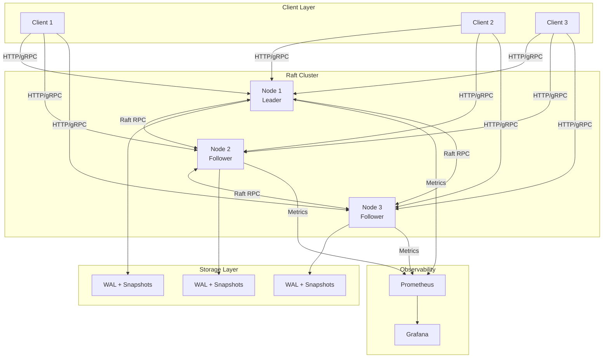
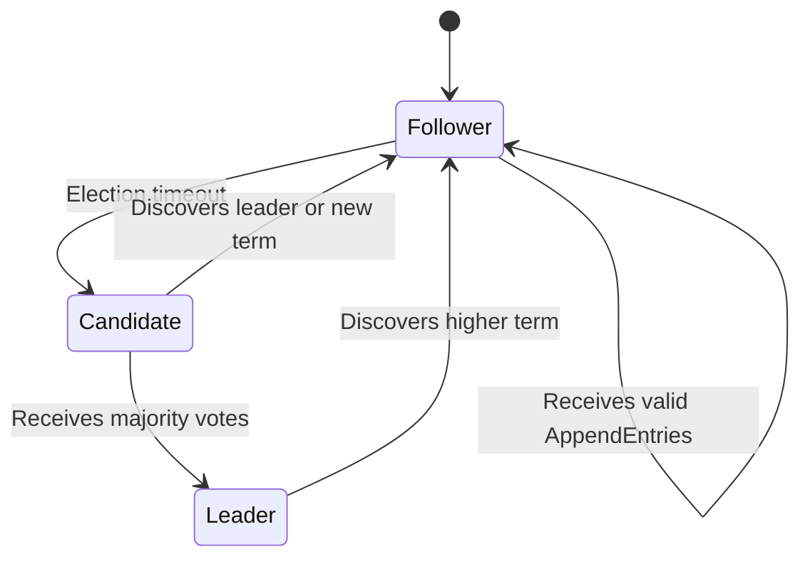
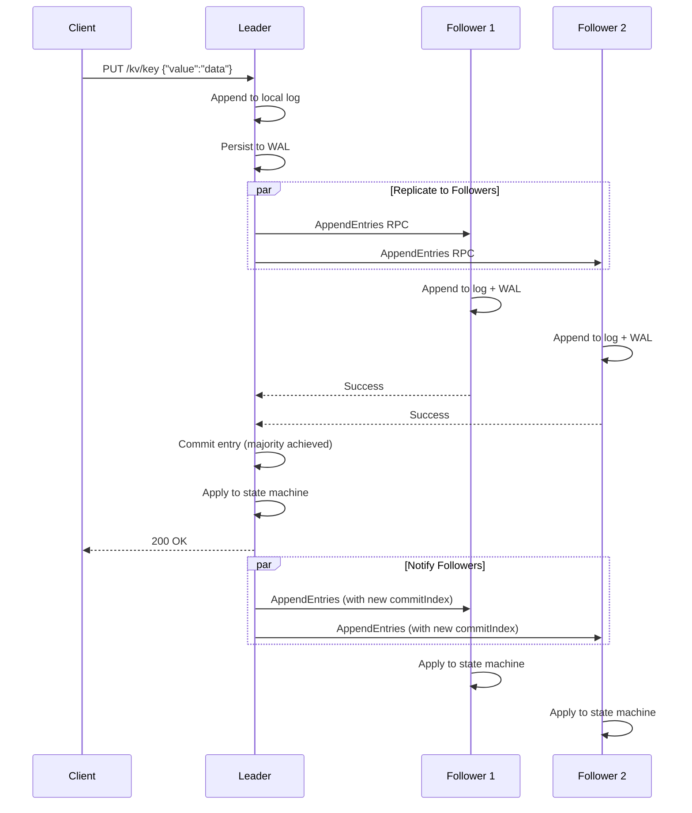
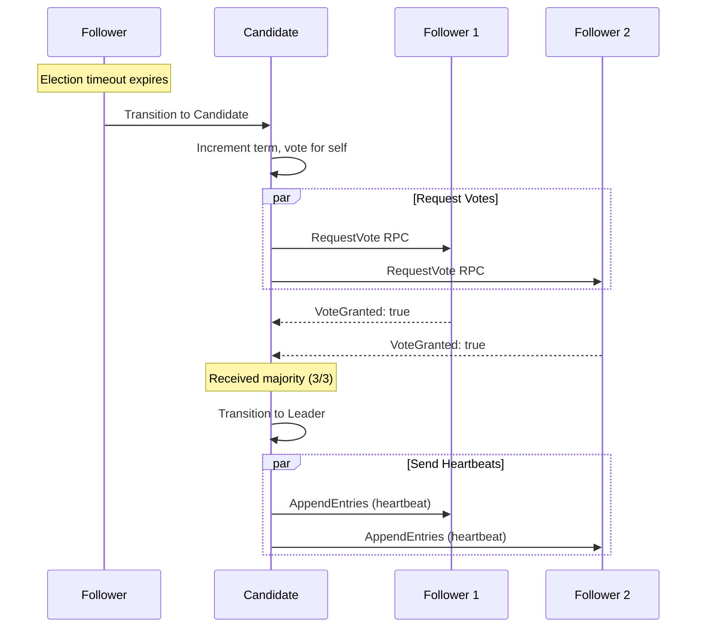

# Architecture Overview

## System Design

Conflux is a distributed key-value store built on the Raft consensus algorithm. The system is designed for strong consistency, high availability, and operational simplicity.

## High-Level Architecture



## Core Components

### 1. Raft Consensus Layer

**Purpose**: Ensures all nodes agree on the order of operations

**Key Features**:
- Leader election with randomized timeouts (150-300ms)
- Log replication with consistency checks
- Automatic failure detection and recovery
- Split-brain prevention via majority quorum

**Implementation**: [`pkg/raft/`](../../pkg/raft/)

**State Machine**:


### 2. Key-Value State Machine

**Purpose**: Applies committed Raft log entries to the in-memory store

**Operations**:
- `PUT(key, value)` - Set or update a key
- `GET(key)` - Retrieve a value
- `DELETE(key)` - Remove a key

**Implementation**: [`pkg/kv/`](../../pkg/kv/)

**Characteristics**:
- Deterministic: Same log → same state
- In-memory for fast access
- Thread-safe with mutex protection
- Snapshot support for compaction

### 3. Persistence Layer

**Components**:
- **Write-Ahead Log (WAL)**: Durable log of all operations
- **Snapshots**: Periodic state checkpoints for faster recovery

**Implementation**: [`pkg/wal/`](../../pkg/wal/), [`pkg/snapshot/`](../../pkg/snapshot/)

**Recovery Process**:
1. Load latest snapshot (if exists)
2. Replay WAL entries since snapshot
3. Rebuild in-memory state

### 4. HTTP API Layer

**Purpose**: Provides RESTful interface for clients

**Endpoints**:
- `GET /kv/{key}` - Read value
- `PUT /kv/{key}` - Write value
- `DELETE /kv/{key}` - Delete value
- `GET /health` - Health check
- `GET /metrics` - Prometheus metrics

**Implementation**: [`pkg/api/`](../../pkg/api/)

**Features**:
- Leader redirection for writes
- Panic recovery middleware
- Structured logging
- Prometheus instrumentation

### 5. Kubernetes Operator

**Purpose**: Automates cluster lifecycle management

**Responsibilities**:
- Create and manage StatefulSets
- Configure DNS-based peer discovery
- Manage PersistentVolumeClaims
- Update cluster configuration
- Monitor cluster health

**Implementation**: [`operator/`](../../operator/)

**CRD**: `RaftCluster`
```yaml
apiVersion: raft.conflux.io/v1alpha1
kind: RaftCluster
metadata:
  name: raft-sample
spec:
  replicas: 3
  image: hugo/raft-node:latest
  resources:
    requests:
      memory: "256Mi"
      cpu: "100m"
```

## Data Flow

### Write Operation



### Read Operation

**From Leader** (Linearizable):
```
Client → Leader → State Machine → Response
```

**From Follower** (Potentially Stale):
```
Client → Follower → State Machine → Response
```

### Leader Election



## Consistency Model

### Guarantees

- **Linearizability**: All operations appear to execute atomically at a single point in time
- **Durability**: Committed writes survive node failures (WAL + majority replication)
- **Total Ordering**: All nodes apply operations in the same order

### Trade-offs

- **Availability**: Requires majority quorum (2/3 nodes for 3-node cluster)
- **Latency**: Write latency includes network round-trip for replication
- **Read Consistency**: Reads from followers may be stale

## Failure Scenarios

### Leader Failure

1. Followers detect missing heartbeats (election timeout)
2. Followers transition to candidates
3. New leader elected via majority vote
4. New leader replicates uncommitted entries
5. Cluster resumes normal operation

**Recovery Time**: ~150-300ms (election timeout)

### Follower Failure

1. Leader detects failed AppendEntries RPCs
2. Leader continues with remaining followers
3. Failed follower restarts and rejoins
4. Leader brings follower up-to-date via log replication

**Impact**: None (if majority still available)

### Network Partition

**Scenario**: 3-node cluster splits into [1] and [2] partitions

- **Majority partition [2]**: Continues operating normally
- **Minority partition [1]**: Cannot elect leader, rejects writes
- **After partition heals**: Minority rejoins, syncs from leader

## Performance Characteristics

### Throughput

- **Writes**: Limited by leader's disk I/O and network to followers
- **Reads**: Scales linearly with number of nodes (if stale reads acceptable)

### Latency

- **Write latency**: 1-10ms (local network) to 50-100ms (cross-region)
  - Components: Leader log append + Network RTT + Follower append
- **Read latency**: <1ms (in-memory lookup)

### Scalability

- **Cluster size**: Typically 3-7 nodes (odd numbers for quorum)
- **Data size**: Limited by available memory (snapshots help)
- **Request rate**: 10k-100k ops/sec depending on hardware

## Design Decisions

### Why Raft?

- **Understandability**: Easier to reason about than Paxos
- **Proven**: Used in production by etcd, Consul, CockroachDB
- **Strong consistency**: Linearizable reads/writes
- **Leader-based**: Simplifies client interaction

### Why In-Memory State Machine?

- **Performance**: Sub-millisecond read latency
- **Simplicity**: No external database dependencies
- **Snapshots**: Periodic checkpoints prevent unbounded memory growth

### Why Kubernetes Operator?

- **Automation**: Declarative cluster management
- **Cloud-native**: Integrates with Kubernetes ecosystem
- **Scalability**: Easy horizontal scaling via StatefulSets

## See Also

- [Raft Consensus Details](raft-consensus.md)
- [Persistence Design](persistence.md)
- [Operator Design](operator.md)
- [Raft Paper](https://raft.github.io/raft.pdf)
